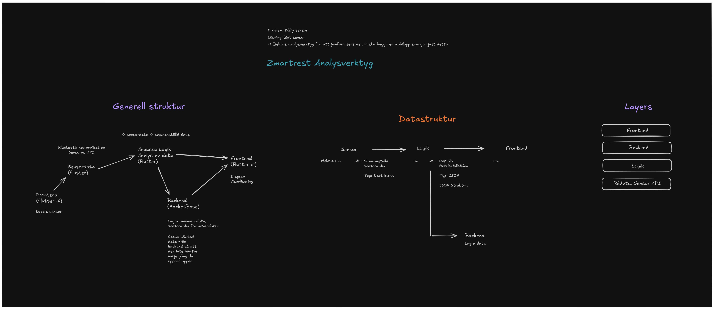

# Zmartrest Analytics App
The **Zmartrest Analytics App** enables users to track and log activity and health-related data collected by the Polar Verity Sense sensor. Developed using [Flutter](https://flutter.dev) and written in [Dart](https://dart.dev), this app was built as a request from [Zmartrest](https://zmartrest.ai) to explore the capabilities of this new sensor.

## Table of Contents

- [Features](#features)
- [Initial Plan](#initial-plan)
- [Screenshots](#screenshots)
- [Install](#install)
- [Testing](#testing)
- [Known issues](#known-issues)

## Features

- **Real-Time Data Tracking:** Monitor heart rate, accelerometer data, rmssd and other health metrics in real-time.
- **Activity Logging:** Save session data for future analysis.
- **User-Friendly Interface:** Simple and intuitive design, with customizable themes.
- **Cross-Platform Support:** With Flutter, this app can be developed for multiple platforms, including Android, iOS, and Web.

## Initial Plan

(In swedish)


## Screenshots

## Install

To get started with the Zmartrest Analytics App, follow these steps:

1. **Set Up Flutter:**
   - Ensure Flutter is installed by following the [official installation guide](https://docs.flutter.dev/get-started/install).
   - Confirm Dart is properly configured.

2. **Clone the Repository:**
   ```bash
   git clone https://github.com/JakobGillarKebab/3-fas-projekt-zmartrest.git
   ```

3. **Install Dependencies:**
   Navigate to the project directory and run:
   ```bash
   flutter pub get
   ```

4. **Prepare Your Device:**
   - For emulators: Set up an Android or iOS emulator using Android Studio or Xcode.
   - For physical devices: Ensure your phone is in developer mode and connected to your computer.

## Testing

1. **Launch the App:**
   - Open your terminal, navigate to the project directory, and run:
     ```bash
     flutter run lib/main.dart
     ```

2. **Connect the Polar Verity Sense Sensor:**
   - Ensure the sensor is turned on and within range.
   - Follow on-screen instructions to pair the sensor with the app.

3. **Start Tracking:**
   - View real-time health metrics or log sessions for detailed analysis.


## Known issues

Over time when large amounts of data is collected, the app may become slow because of the large amount of data being stored in memory. This issue could be resolved   by implementing a more efficient data storage solution, such as continuesly writing data to the local device storage.
